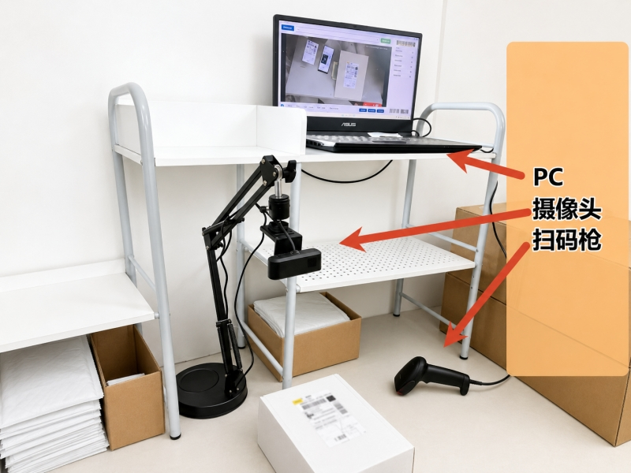
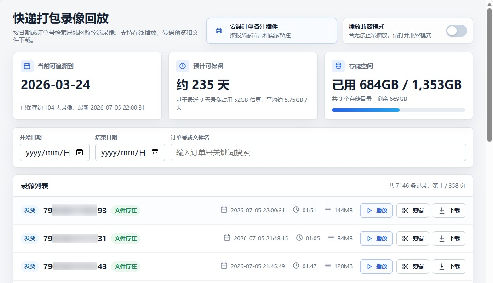

# 快递打包监控 (Express Packing Monitoring)

面向电商仓库、快递打包站和自营小团队的 Windows 打包录像与订单核对工具。软件通过 USB 摄像头、扫码枪、FFmpeg 编码、局域网 Web 回放和订单信息推送，把“扫码、播报、录像、检索、举证”串成一条闭环，降低错发、漏发和售后取证成本。



## 适用场景

- 打包人员需要在扫描快递单号时自动开始录像，并在发货后停止录制。
- 订单备注、商品明细需要在打包现场语音播报，减少反复切换浏览器页面。
- 售后需要按快递单号快速搜索录像，直接在线播放或下载原文件。
- 打包工位需要长期运行，要求掉电、异常退出后尽量保留已录制内容。
- 存储空间有限，需要按磁盘配额自动清理旧录像。

## 核心能力

### 订单推送与语音播报

- 配套油猴脚本可监听快递助手打印动作，自动推送快递单号、买家留言、卖家备注和商品信息。
- 扫码枪输入单号后，软件可自动匹配订单信息并播报备注与商品明细。
- 默认使用 Edge TTS 在线神经语音；Kokoro 本地 AI 语音引擎可按需自行配置。
- 支持语音缓存，相同文本后续可直接复用，减少重复生成等待。

### 高可靠录像

- 使用 MKV 作为录制容器，异常断电或程序退出时更容易保留已写入内容。
- 录制完成后自动转码为 MP4，兼顾录制可靠性与常见设备播放兼容性。
- 支持 H.264、H.265、AV1 编码，并可检测 NVIDIA NVENC、AMD AMF、Intel Quick Sync 等硬件编码器。
- 支持录制水印，在画面中叠加快递单号和实时时间戳，便于售后追溯。
- 支持静止超时自动停录和摄像头休眠，减少无效录像。

### 局域网 Web 回放

- 内置 HTTP 回放服务，同一局域网内的手机、电脑和平板可通过浏览器访问。
- 支持按快递单号精准搜索、按日期范围筛选、在线播放和原文件下载。
- 支持 H.265 到 H.264 的兼容转码缓存，改善浏览器播放兼容性。



### 存储与工作流控制

- 支持配置多个存储路径，并按优先级选择可用磁盘。
- 每个存储路径可设置独立磁盘配额，空间不足时自动删除最旧录像。
- 支持 START、STOP、SHIP、BACK、CLEAR 等条码指令，打包过程中可不接触键盘鼠标。
- 支持全局键盘监听，软件在后台时也能接收扫码枪输入。
- 内置扫码冷却机制，降低重复扫描导致的误操作。

## 硬件要求

| 类型 | 要求说明 |
| --- | --- |
| USB 摄像头 | 支持 UVC 协议的 USB 摄像头、电脑内置摄像头或 OBS 虚拟摄像头，推荐 1080P 及以上分辨率 |
| 条码扫描枪 | 支持键盘输出的有线或无线扫码枪，无需专用驱动 |

## 运行环境

- 操作系统：Windows 10/11 x64
- 运行时：[.NET 8.0 Desktop Runtime](https://dotnet.microsoft.com/en-us/download/dotnet/8.0)
- 编码工具：`ffmpeg.exe`，推荐 Full 版本

`ffmpeg.exe` 可放在以下任一位置：

- 发布包的 `app\tools\ffmpeg.exe`
- 程序运行目录
- 已加入系统 `PATH` 的目录

## 编译与发布

```powershell
# 克隆仓库。GitHub 为主仓库，Gitee 为同步镜像，二选一即可。
git clone https://github.com/m-RNA/ExpressPackingMonitoring.git
# git clone https://gitee.com/chenjjian/ExpressPackingMonitoring.git

cd ExpressPackingMonitoring

# 编译运行
dotnet run --project ExpressPackingMonitoring

# 发布为目录包：根目录启动器 + app 子目录
powershell -ExecutionPolicy Bypass -File build\Publish-CleanPackage.ps1
```

发布脚本会生成目录包和同名 `.zip`。发布后的根目录主要保留 `ExpressPackingMonitoring.exe` 和 `app\`，真实主程序、依赖 DLL、`tools\ffmpeg.exe`、Web 页面和 LibVLC 文件位于 `app\` 内。

发布包不会包含 `config.json`、`videos.db`、缓存、日志或录像文件。运行时数据默认保存在：

```text
%LOCALAPPDATA%\ExpressPackingMonitoring\
```

因此用户升级到新版本并解压到新目录时，配置和数据库会继续沿用。

## 功能启用

### 快递助手订单推送

1. 安装 Tampermonkey 或 Violentmonkey 浏览器扩展。
2. 打开仓库内 `Scripts/快递助手订单推送.user.js` 并安装脚本。
3. 默认上位机连接地址为 `http://127.0.0.1:5280`。
4. 如果浏览器和上位机不在同一台电脑，通过脚本菜单把地址改为上位机 IP 和端口。
5. 脚本 1.2 起可在菜单里点击“发送测试订单”，确认监控工位能收到订单备注。
6. 在快递助手页面打印订单时，脚本会自动把订单信息推送给上位机。

### 局域网 Web 回放

1. 打开软件设置页面，进入“高级设置”。
2. 开启“启用 Web 服务”，默认端口为 `5280`。
3. 保存设置并重启软件。
4. 同网设备访问 `http://[上位机IP]:5280`。

如果首次启动 Web 服务时触发系统权限或防火墙提示，请按系统提示允许本机监听该端口。

### AI 语音

1. 打开软件设置页面，进入“高级设置”。
2. 开启“启用 AI 语音”。
3. 默认使用 Edge TTS，需保持网络可用。
4. 如需使用 Kokoro 本地模型，请自行准备模型和本地运行依赖；默认发布包不附带 Kokoro 依赖。

可按需下载 Kokoro 模型：

```powershell
Invoke-WebRequest -Uri "https://github.com/k2-fsa/sherpa-onnx/releases/download/tts-models/kokoro-multi-lang-v1_0.tar.bz2" -OutFile "kokoro-multi-lang-v1_0.tar.bz2" -UseBasicParsing
```

## 技术栈

- .NET 8.0 Windows / WPF
- MVVM / CommunityToolkit.Mvvm
- AForge.Video
- OpenCvSharp4
- FFmpeg
- Microsoft.Data.Sqlite
- Extended.Wpf.Toolkit

## 许可证

本项目使用 [AGPL-3.0 License](LICENSE) 开源。

- 个人学习、自家店铺自用可以免费使用。
- 修改后对外分发或提供网络服务时，需要遵守 AGPL-3.0 的开源义务。
- 二次修改分发时请保留原作者署名、版权声明和许可证信息。

使用前请自行确认你的使用方式是否满足 AGPL-3.0 要求。
