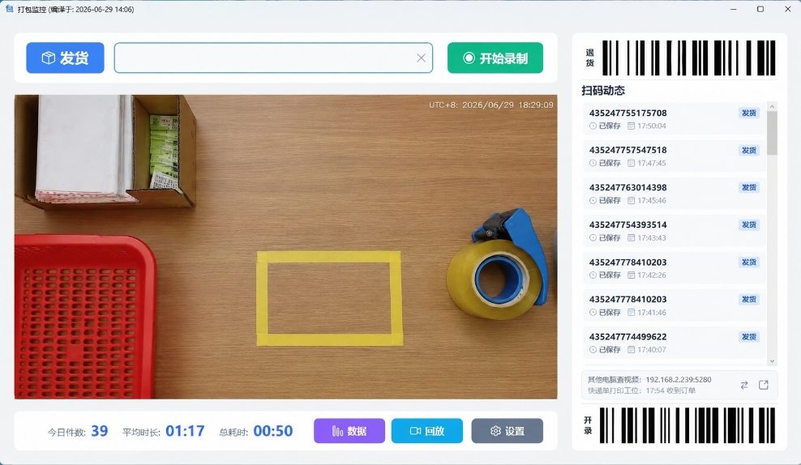

# 快递打包监控

一个给电商打包工位用的 Windows 录像工具。扫码后自动录像，发货后自动结束，后面可以按快递单号查录像，方便核对和售后取证。

## 适合谁用

- 打包时想自动录像，少手动点按钮。
- 想按快递单号快速找到对应录像。
- 需要播报买家留言、卖家备注或商品信息。
- 想让手机或其他电脑在局域网里查看录像。
- 磁盘空间有限，希望旧录像能自动清理。

## 主要功能

- 扫码自动开始录像，发货后自动停止。
- 支持摄像头录制、声音录制和录像水印。
- 录像列表可按单号搜索，也可通过网页回放。
- 支持订单备注语音播报。
- 支持多个保存位置，空间不足时自动清理旧录像。

## 需要准备

- Windows 10/11 x64 电脑
- USB 摄像头
- 键盘模式的扫码枪
- [.NET 8.0 Desktop Runtime](https://dotnet.microsoft.com/en-us/download/dotnet/8.0)
- `ffmpeg.exe`，推荐使用 Full 版本

## 快速开始

1. 打开软件，进入设置页。
2. 选择摄像头和麦克风。
3. 设置录像保存位置。
4. 扫描快递单号开始录像。
5. 发货或扫描停止指令后结束录像。
6. 需要查看时，在录像列表里输入快递单号搜索。

## 局域网回放

1. 在设置页开启 Web 服务。
2. 保存设置并重启软件。
3. 同一局域网设备访问 `http://电脑IP:5280`。

如果系统弹出防火墙提示，请允许访问。

## 订单备注播报

需要配合浏览器脚本使用：

1. 安装 Tampermonkey 或 Violentmonkey。
2. 安装仓库里的 `Scripts/快递助手订单推送.user.js`。
3. 打印订单时，脚本会把订单信息发送给监控端。
4. 监控端收到订单后，可播报备注和商品信息。

## 录像保存

软件会把配置、数据库、日志和录像保存在本机用户数据目录中。升级软件时，只要不删除用户数据，原来的配置和录像记录会继续保留。

## 许可证

本项目使用 [AGPL-3.0 License](LICENSE) 开源。

个人学习、自家店铺自用可以免费使用；如果修改后对外分发或提供网络服务，需要遵守 AGPL-3.0 的开源要求。

